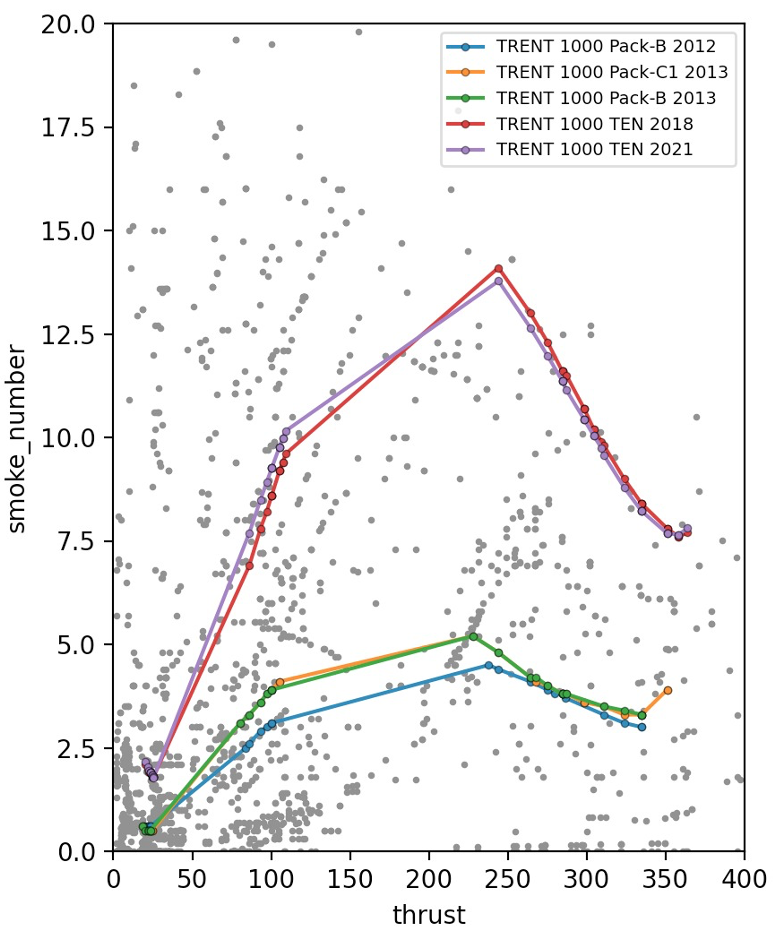

## Disclaimer
- This package is not affiliated with the ICAO

## Purpose
This library is designed to facilitate interaction with the International Civil Aviation Organization (ICAO) emission databanks, which include noise and emissions data. This library provides users with the following features: 

🗂 Access to icao emission databanks: gaseous and nvPM<br>
🎛 Calculate the certification data (characteristic value, margin, ...)<br>
📈 Visualization of databanks in relation to regulatory standards


This library is perfect for researchers, engineers, policy-makers, and enthusiasts looking to analyze and visualize aviation emission data.

## Emission Standards and certification

<details>  
  <summary> 💈 Here is the status of standards available within the library: </summary>
  
##### subsonic: 
🟢 NOx (CAEP8, CAEP6, CAEP4, CAEP2, CAEE)<br>
🟢 CO<br>
🟢 HC<br>
🟢 Smoke Number<br>
🟢 nvPM mass<br>
🟢 nvPM number<br>
🟢 nvPM mass concentration<br>

##### supersonic: 
🟢 NOx<br>
🟢 CO<br>
🟢 HC<br>
🟢 Smoke Number<br>
 </details>

```python
from pprint import pprint

from icao_emissions.certification import certificate
from icao_emissions.certification.data import CAEP8
from icao_emissions.certification.subsonic_standards import caep8

# PW1122G-JM - UID:01P22PW158
data = CAEP8(
    rated_thrust=107.82,
    opr=28.78,
    number_engines_tested=1,
    fuel_massflow=(0.710, 0.600, 0.210, 0.080),
    nox=(18.206, 15.392, 10.422, 5.008),
    co=(0.320, 0.437, 5.940, 25.907),
    hc=(0.068, 0.065, 0.060, 0.510),
    smoke_number=(5.263, 3.132, 0.294, 0.780),
)

certification = certificate.subsonic(data, caep8)

pprint(certification, sort_dicts=False)
```
```python
{'engine_parameters': {'rated_thrust': 107.82,
                       'opr': 28.78,
                       'fuel_massflow': (0.71, 0.6, 0.21, 0.08)},
 'nox_caep8': CertificationData(is_certified=True,
                                percent_of_limit=64.7%,
                                number_engines_tested=1,
                                characteristic=31.3,
                                limit=48.4,
                                total_emission_mass=2912),
 'co': CertificationData(is_certified=True,
                         percent_of_limit=34.5%,
                         number_engines_tested=1,
                         characteristic=40.7,
                         limit=118.0,
                         total_emission_mass=3577),
 'hc': CertificationData(is_certified=True,
                         percent_of_limit=5.4%,
                         number_engines_tested=1,
                         characteristic=1.1,
                         limit=19.6,
                         total_emission_mass=74),
 'smoke_number': CertificationData(is_certified=True,
                                   percent_of_limit=29.2%,
                                   number_engines_tested=1,
                                   characteristic=6.8,
                                   limit=23.2,
                                   total_emission_mass=517)}
```

## Plot NOx Characteristic
```python
from icao_emissions import databanks
from icao_emissions.plot import Characteristic


# Load the gaseous certification databank
df = databanks.load_gaseous_certification()

# Select some engines
query = {'engine': ('LEAP-1A', 'PW1100G Block-D')}
df = databanks.filter(df, query)

# Plot
Characteristic(df).nox()
```


## Plot emissions from databanks
```python
from icao_emissions import databanks
from icao_emissions.plot import Figure


# Load the gaseous certification databank
df = databanks.load_gaseous_emissions()

# Select some engines
query = {'engine': ('TRENT 1000')}
df = databanks.filter(df, query)

# Plot
figure = Figure()
figure.add(
    Scatter(df, 'thrust', 'smoke_number', color_by='engine')
)

figure.show()
```


## Source
- https://www.easa.europa.eu/domains/environment/icao-aircraft-engine-emissions-databank
- https://ffac.ch/wp-content/uploads/2020/10/ICAO-Annex-16-Environmental-protection-Vol-II-Aircraft-Engine-Emissions.pdf

